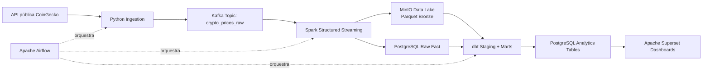

# Arquitetura da Plataforma de Dados

## Visão geral
A plataforma implementa um fluxo moderno de dados orientado a eventos com camadas de **ingestão**, **streaming**, **processamento**, **data lake**, **transformação analítica**, **warehouse** e **BI**.

## Diagrama (Mermaid)

## Fluxo de dados
1. O coletor Python consulta a API CoinGecko em intervalos fixos.
2. Cada evento é publicado no Kafka (`crypto_prices_raw`).
3. O Spark consome o tópico em streaming contínuo.
4. O Spark grava os dados em Parquet no MinIO (camada Bronze) e também persiste no PostgreSQL (raw fact).
5. O dbt lê as tabelas raw e cria modelos staging e marts analíticos.
6. O Superset consome as tabelas analíticas no PostgreSQL para visualização.
7. O Airflow coordena inicialização do bucket, execução de jobs e auditoria do pipeline.

## Práticas de produção incorporadas
- Separação por camadas (raw/bronze/staging/mart).
- Formato colunar Parquet para eficiência analítica.
- Streaming desacoplado com Kafka.
- Orquestração e observabilidade operacional no Airflow.
- Transformações versionadas com dbt.

## Melhorias futuras
- Monitoramento com Prometheus + Grafana e alertas no Alertmanager.
- Data quality com Great Expectations ou Soda.
- CI/CD com GitHub Actions (lint + testes + build + deploy local automatizado).
- Evolução para camadas Silver/Gold com particionamento temporal e compactação.
- Catalogação de dados (OpenMetadata/DataHub).
- Escalabilidade horizontal de Kafka/Spark e particionamento por chave de negócio.
